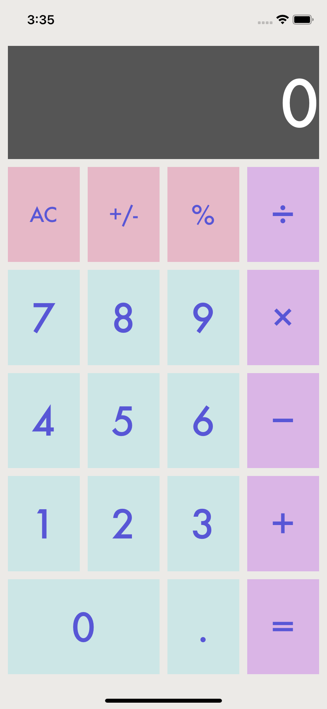

# iOS简易计算器实现

### 191220111 王凯文

### 1.测试环境：

- Xcode-13
- iphone-13pro/11

### 2.运行界面

|  |  |
| ------------------ | ------------------ |

|  |
| ------------------ |
|  |

### 3.基本思路

​	主要是先按照老师的教程视频走一遍，踩一下可能的坑。

##### ---界面

​	用`storyboard`显示化地设计界面还是比较舒服的，界面布局利用`auto layout`可以很方便地适应不同尺寸的屏幕，`UI`是慢慢迭代的，在这个过程中对`auto layout`，`IB`等Swift相关技术的理解也慢慢深入。

​	横屏界面，可以为不同内容设置不同`size class`下是否`installed`来决定是否加载显示。

​	圆角设置，通过`runtime attribute`设置。如下是对比图，各有所好，不是说圆角就一定更好看。

​	启动界面，设置了一个简单的静态启动界面，有时启动较快启动界面停留时间较短。

|  |  |
| ------------------ | ------------------ |

##### ---计算

​	主要是像示例视频中那样创建一个Calculator类来单独处理计算功能，这在OOP中很常见，不同的模块处理不同的功能使得代码逻辑更为清晰。

x!：模仿官方计算器，0结果为1，正负整数显示结果，非整数屏幕不显示，即无法运算。

Rad/Deg模式选择在横屏模式下添加一个label标签显示当下模式。


### 4.难点及解决方案：

横屏如何解决，一开始想尝试多个View Controller，但老师上课时提到计算器是典型的单个View的app，后面的开发才会使用到多个View。

Auto layout确实很方便，老师也提到了很多，绘制竖屏的UI很方便，但是怎么在横屏显示不一样的内容一开始确实比较confusing，好在翻了官方文档后并结合老师课件后，得到如下解决方案


有一些操作可能直接在单目，双目操作内不太方便，于是在enum Operation针对一些情况分别设立了case，比如rad/deg模式，M+模式等，并结合类中其他自定义函数完成一些计算。

按照老师的示例写计算功能。

遇到问题：启动计算器后，如果直接点Rand，pi等单目操作符会遇到问题报错

```swift
Thread 1: Fatal error: Unexpectedly found nil while unwrapping an Optional value
```

后与系统计算器对比，发现开始时屏幕上初始值为0，示例中设置为空，故一开始digitondisplay为nil报错，修改viewDidLoad后得到解决

```swift
- self.display.text! = ""
+ self.display.text! = "0"
```

启动计算器后如果直接按某一个数字后，紧接着按=号，会报错崩溃，排查后，发现示例中=号处理不够全面，加入先前有无操作符（+，-等）按下的bool判断即可，且2+3=，=，=，这样的操作苹果计算器给出的答案是5，8，11，但结合其他计算器（卡西欧，其他手机等），修复为答案为5，5，5不变。

Rand如果做const处理每次会返回同样的值，应做单目操作符处理。

处理sin的时候对比标准计算器发现swift sin函数默认对应rad（弧度制），而不是计算器默认的deg（角度制），这一点尤其需要注意。同时处理rad，增加rad操作符和radOn bool变量处理，rad模式只对sin，cos等角/弧度操作做不同处理方案，考虑横屏模式下增加rad模式标识（显示为Rad或Deg）。


### 总结：

尽力而行，虽然不能像标准计算器那样尽善尽美，有一些思路，但没有找到太好的解决方案。不过感觉重点还是老师示例中的enum等巧妙的操作。